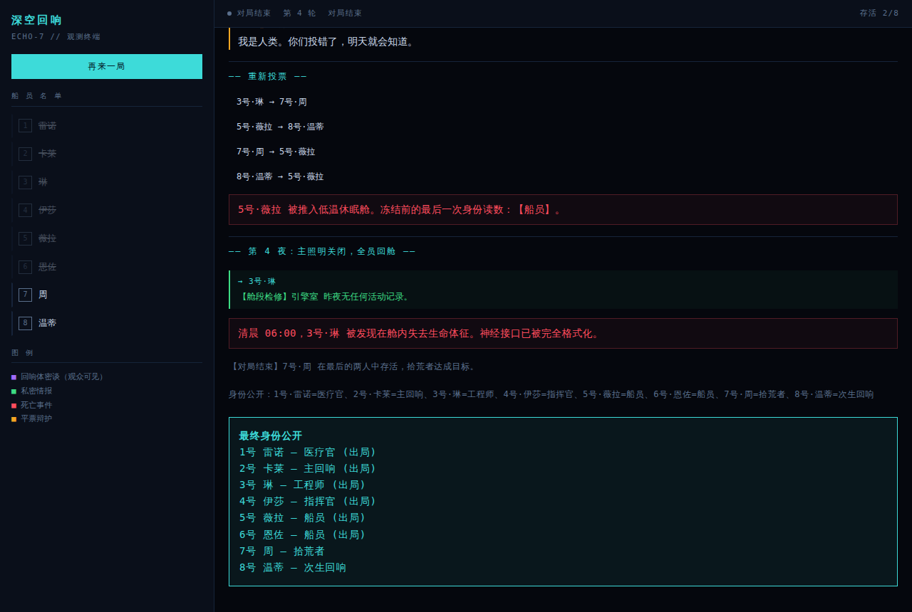

# Space Social Deduction

两个太空主题的 AI 社交推理游戏。共同的问题是：**当 AI 只能看到它该看到的东西时，
它的推理和欺骗还成立吗？**

| | [echo-station](echo-station/) | [impostor-log](impostor-log/) |
|---|---|---|
| 形态 | Python 项目 | 单文件 HTML |
| 你的角色 | 观战 | 内鬼 |
| AI 扮演 | 全部 8 名船员 | 4 名船员 |
| 空间/移动 | 无（纯文字局） | 有（地图 + 摇杆 + 通风管） |
| 目击如何产生 | 引擎按 `visible_to` 分发 | 从坐标和视距实时计算 |
| 依赖 | fastapi / openai | 无，双击即玩 |

---

## echo-station · 深空回响

8 个 LLM agent 各自扮演科考站船员，独立推理、撒谎、结盟、投票。你在浏览器里实时观战。



三方阵营：5 人类 / 2 回响体 / 1 拾荒者（独立胜利，只想活到最后两人）。

```bash
cd echo-station
pip install -r requirements.txt

LLM_MOCK=1 python run_cli.py            # 不花钱，秒出结果
uvicorn web.server:app --port 8100      # 实时观战界面
python tests/test_invariants.py         # 跑测试
```

接真模型只改环境变量，任何 OpenAI 兼容端点都行：

```bash
export LLM_BASE_URL=https://api.deepseek.com/v1
export LLM_API_KEY=sk-xxx
export LLM_MODEL=deepseek-chat
```

详见 [echo-station/RULES.md](echo-station/RULES.md)（完整规则与世界观）。

### 平衡性

用不同"推理准确率"的模拟 agent 各跑 300 局：

| 推理准确率 | 人类胜 | 回响体胜 | 拾荒者胜 |
|---|---|---|---|
| 0%（纯随机） | 10.3% | 84.5% | 5.5% |
| 35% | 48.3% | 43.0% | 8.8% |
| 65% | 83.0% | 11.2% | 5.2% |

胜率对推理能力高度敏感，50/50 平衡点落在 35% 准确率附近。

> 关键平衡阀：回响体需要**严格多于**人类。早期版本用"不少于"，
> 回响体胜率 85%、拾荒者一局都赢不了。

---

## impostor-log · 目击日记

Among Us 式的地图和移动，但会议阶段交给真模型。你是内鬼，四个 AI 船员各自记录
自己的目击日记，开会时拿日记和你的说辞逐条对账。


```bash
cd impostor-log
python -m http.server 8000      # 然后打开 index.html
```

右上角「AI」按钮填入 OpenAI 兼容端点即可。不填则使用内置规则 AI，照常能玩。

**核心机制**：每个 AI 每 0.5 秒记一条日记 —— 我在哪、看见谁、谁在做任务、当时黑没黑灯。
断电时视野砍半，日记自动变模糊。你辩解时随便打字，模型拿你的话去和它的日记对账：

> 紫(你)：我一直在导航室做接线
> 红：不对，t=12.5s 我在电力室看见你了，你说你在导航室？

**信息噪声是从世界规则里长出来的**，不是硬塞的 —— 这是它和 echo-station
（靠"每 3 次查验反转 1 次"制造噪声）最大的设计差异。

船员的**行动**也建立在同样的受限信息上：每个人从自己的日记里长出一份怀疑度
（在场却不做任务 ↑、凭空消失 ↑↑、蹲在任务点上 ↓），过线就放下任务跟上来盯梢。
所以"假装做任务"不只是给开会时的日记留个记录，而是当场就能把身上的怀疑压下去。

---

## 设计要点

**信息隔离由引擎保证，不靠 prompt 自觉。** 两个项目都在数据层做物理过滤，
而不是在 prompt 里写"请不要使用你不该知道的信息"。echo-station 用 7.6 万次
可见性检查验证零泄露。

**引擎不信任模型的任何返回值。** 空字符串、markdown 代码块、超范围数字、
乱码 —— 全部有强制校验和随机兜底。400 局畸形输入压测零崩溃。
兜底不是静默的：echo-station 每局都会报出有多少次决策没能采纳模型返回值，
兜底率飙高说明端点出了问题，而不是模型变笨了。

**模型挂了游戏也要能玩。** 两个项目都保留完整的规则 AI 作为降级路径，
impostor-log 还做了主/备双端点 failover。

---

## 给 AI 助手

如果你是 AI 助手在接手这个仓库，请先读 [AGENTS.md](AGENTS.md) ——
里面写了不可破坏的不变量、架构约定、以及各类改动的入手点。

## License

MIT
