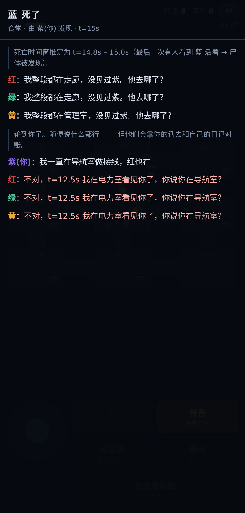

# 目击日记 · impostor-log

Among Us 式的太空内鬼游戏。你是内鬼，四个 AI 船员各自记录目击日记，
开会时拿日记和你的说辞逐条对账。

单文件，零依赖，零构建。



## 玩

```bash
python -m http.server 8000
# 打开 http://127.0.0.1:8000/index.html
```

直接双击 `index.html` 也能玩（规则 AI 模式）。要用真模型则需要通过 http 服务打开，
否则浏览器会因为 `file://` 协议拦掉跨域请求。

**接模型**：点右上角「AI」按钮，填 OpenAI 兼容端点：

| 服务 | 地址 | 模型 |
|---|---|---|
| DeepSeek | `https://api.deepseek.com/v1` | `deepseek-chat` |
| OpenAI | `https://api.openai.com/v1` | `gpt-4o-mini` |
| 智谱 | `https://open.bigmodel.cn/api/paas/v4` | `glm-4-flash` |
| Ollama | `http://localhost:11434/v1` | `qwen2.5:14b` |

可选再填一组备用端点，主端点失败会自动切换。不填任何配置则使用内置规则 AI。

> ⚠️ **密钥安全**：key 存在浏览器 localStorage 里，只在你这台设备上。
> 但它会随请求出现在浏览器「网络」面板 —— 录屏或直播前点「清除密钥」。
> **不要把填好 key 的页面部署到公网。**

## 操作

| | |
|---|---|
| 移动 | 摇杆 / WASD / 方向键 |
| 刀 | 靠近船员，12 秒冷却 |
| 报告 | 站在尸体旁 |
| 钻管道 | 站在通风口上（被看见就完了） |
| 断电 | 全船视野砍半，任务全停 |
| 反应堆熔毁 | 30 秒内没有两人去修，你直接赢 |

## 核心机制：目击日记

每个 AI **每 0.5 秒**记一条：

```json
{ "t": 12.5, "room": "电力室", "saw": ["红","绿"], "doing_task": ["绿"] }
```

`saw` 只包含**同房间且距离小于视距**的人。断电时视距从 265 掉到 130，
日记自动变模糊 —— 信息噪声是从世界规则里长出来的，不是硬塞的。

开会时这份 JSON 原样喂给模型。会议结束后可以点「查看目击日记」展开看
喂进去的原始输入。

## 行为层：船员会盯着你

船员在地图上的行动不再是"闷头做任务"。每个人从**自己的日记**里长出一份怀疑度：

| 从日记里看到的 | 怀疑度 |
|---|---|
| 那个人蹲在任务点上（`tk` 里有他） | ↓ 洗清 |
| 那个人在场却什么都不干 | ↑ 慢慢涨 |
| 断电时和那个人待在一起 | ↑ |
| 我没挪窝，他却凭空从眼前消失 | ↑↑ 可能钻了管道 |
| 亲眼看见他动手（`kill`） | 顶满 |

过线之后，船员会**放下任务跟上来盯梢**。于是「假装做任务」第一次有了行为层的
回报——不是等到开会才被翻日记，而是当场把身上的怀疑度压下去。

数值是调过的：真船员一个任务要蹲 14 秒，洗清速度（-2.0）远快于积累速度（+0.4），
所以船员之间几乎不会互相怀疑；而你不做任何伪装的话，大约被盯着看 15 秒就会过线。

盯梢受三条约束：

- **最后目击点只在此刻真的看得见目标时才刷新。** 看不见还去追新位置，
  等于读了它不该有的坐标。测试里 `staleWrite` 必须恒为 0。
- **盯梢有预算上限**（8 秒），耗尽就回去干活，免得任务条永远卡住。
- **起停用不同阈值**（起 10 / 续 6），且预算见底后要攒回 4 秒才能再起一次。
  少了这条，怀疑度会卡在阈值上反复横跳——实测 40 秒内起停 27 次，加上之后降到 6 次。

接了模型的话，每 9 秒还会拿它自己的日记问一次「现在最该盯谁」，
结果只对怀疑度做**有界推动**（+3），不接管规则层——模型不可用就完全不动，
规则层照常工作。

## 两个模型调用点

| 函数 | 时机 | 输出 |
|---|---|---|
| `readLLM()` | 会议开始，四人并行 | `{line, suspect}` 发言 + 怀疑度 |
| `defend()` | 你打字辩解之后 | `{verdict, line, delta}` 对账结果 |

`verdict` 三种：`contradict`（戳穿你，带具体时间和房间）、
`confirm`（替你作证）、`unknown`（说不清）。

**铁证不交给模型判断**：日记里有 `SAW_KILL` 或 `SAW_VENT` 时，
代码里硬加 120 分怀疑度。模型可能被你的话术说服，但"亲眼看见你捅刀"
不能取决于模型的心情。

## 降级路径

三层，游戏永远不会卡死在等待里：

1. 主端点失败 → 重试一次
2. 仍失败 → 切备用端点
3. 全挂 → 回落到规则 AI，并在会议里明说「⚠ 模型没能应答，本轮改用内置规则」

## 手机 / 平板

这个游戏本来就是按手机设计的（摇杆 + 触摸），横屏竖屏都能玩。

**推荐用法：在手机浏览器打开线上地址 → 分享 → 添加到主屏幕。**
之后从主屏幕图标进入是全屏运行的，没有地址栏，跟原生 App 一样。

已覆盖的适配（`tests/test_mobile.py` 会逐一检查）：

| | 处理 |
|---|---|
| 手机横屏 | 竖排会把地图压成一条（实测 iPhone 横屏画布只剩 134px 高）。横屏改成「地图占左、控件收进右侧竖栏」 |
| 平板 | ≥700px 时摇杆和按钮同步放大，拇指不用去够小目标 |
| 摇杆 | 几何全部按实际尺寸算，CSS 里改大小不用动 JS；各尺寸下满偏速度一致 |
| 键盘遮挡 | 辩解输入框曾被软键盘盖住。现在会议面板跟随 `visualViewport` 收窄 |
| 地址栏伸缩 | 用 `100dvh`，页面不再跟着地址栏跳动 |

`manifest.webmanifest` 和三个图标只在联网托管时才用得上，
**`index.html` 本身仍然可以单独双击打开就玩**，没有构建、没有依赖。

## 测试

```bash
pip install playwright && playwright install chromium
python tests/test_meeting.py     # 会议流程 / failover / 规则降级 / 行为层
python tests/test_mobile.py      # 5 种手机平板视口：布局、触摸摇杆、键盘、主屏幕安装
```

自动拉起假 LLM 端点，验证三条路径：正常调用、主端点 500 切备用、无配置走规则。
每条路径还会检查行为层：船员是否真的积累了对你的怀疑、盯梢是否只在看得见目标时发起。

> 环境里预装的 chromium 版本和 playwright 对不上时，把 `pw.chromium.launch()`
> 换成 `pw.chromium.launch(executable_path="<chromium 路径>")` 即可，不用重新下载。

## 文件

```
index.html                      游戏本体（唯一需要的文件）
docs-original-rulesonly.html    接模型之前的纯规则版本，留作对照
manifest.webmanifest            「添加到主屏幕」用，游戏本身不依赖它
icon-192/512.png                主屏幕图标（含 maskable）
apple-touch-icon.png            iOS 主屏图标
tests/mock_llm_server.py        假 OpenAI 端点（含行为层 [watch] 分支）
tests/test_mobile.py            手机 / 平板适配测试
tests/test_meeting.py           浏览器端到端测试
```
